# System Architecture & Flows

This diagram illustrates the core architecture of the Intent-Oriented Programming (IOP) system, highlighting the separation between **Planning** (Intent ↔ Orchestrator) and **Implementation** (Orchestrator ↔ Agent).

```mermaid
graph TD
    %% Roles and Zones
    subgraph "Cycle A: Planning (Intent & Spec)"
        Human[("👤 Human Architect")]
        IntentFiles["📄 Intent Files (.intent)"]
        Manifest["📦 Manifest & Locks"]
    end

    subgraph "The Orchestrator (Compiler)"
        Parser["Parsing & Canonicalization"]
        GraphBuilder["Dependency Graph Builder"]
        Validator["Validation & Policies"]
        Differ["Semantic Diff Engine"]
        Planner["Patch Planner"]
    end

    subgraph "Cycle B: Implementation (Execution)"
        Agent["🤖 Agent (Worker)"]
        Codebase["💻 Codebase"]
        Gates["🛡️ Verification Gates"]
    end

    %% Flow: Authoring
    Human -->|Writes/Edits| IntentFiles
    IntentFiles --> Parser
    Manifest --> Parser

    %% Flow: Compilation
    Parser -->|Canonical IR| GraphBuilder
    GraphBuilder -->|Intent Graph| Validator
    Validator -->|Valid Graph| Differ

    %% Diffing
    Differ -->|Semantic Diff| Planner
    Planner -->|Proposed Plan| Human

    %% Flow: Execution
    Human -->|Approves Plan| Planner
    Planner -->|Dispatch Task| Agent

    %% Flow: Agent Work
    Agent -->|Reads| Codebase
    Agent -->|Writes Patch| Codebase

    %% Flow: Verification
    Codebase -->|Changes| Gates
    Gates -->|Unit Tests / Lints| Agent
    Gates -->|Success| Manifest

    %% Flow: Feedback Loop
    Gates -->|Behavioral Review| Human
    Human -.->|Refines Intent| IntentFiles

    %% Styling
    style Human fill:#f9f,stroke:#333
    style Orchestrator fill:#e1f5fe,stroke:#0277bd
    style Agent fill:#fff9c4,stroke:#fbc02d
    style Codebase fill:#e0f2f1,stroke:#00695c
```

## Key Flows Explained

### 1. The Planning Cycle
1.  **Authoring**: The human updates `Intent Files` (declarative spec).
2.  **Compilation**: The **Orchestrator** parses these files into a graph, validates them, and computes a **Semantic Diff** against the previous state.
3.  **Planning**: A **Patch Plan** is generated. The human reviews this plan *before* any code is touched.

### 2. The Implementation Cycle
1.  **Dispatch**: Once approved, the Orchestrator assigns tasks to the **Agent**.
2.  **Execution**: The Agent applies changes to the **Codebase** within strict **Code Anchors**.
3.  **Verification**: Automated **Gates** (tests, lints) check the work. If successful, the **Manifest** is updated.

### 3. The Refinement Loop
If the human spots a behavioral issue during review:
*   They do **not** fix the code manually.
*   They **refine the Intent** (add constraints, update logic).
*   The cycle repeats, ensuring the Intent remains the single source of truth.
